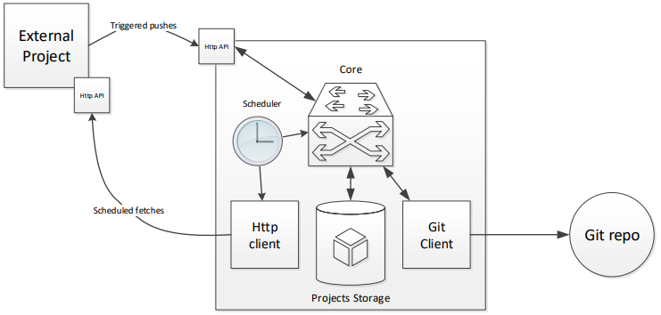

##################
Компоненты системы
##################

Основные компоненты системы: |components|

- ядро
- git repo client
- http endpoint for DAG pushes
- scheduler
- dag/resource fetcher (http client)
- entity storage
- cli interface

