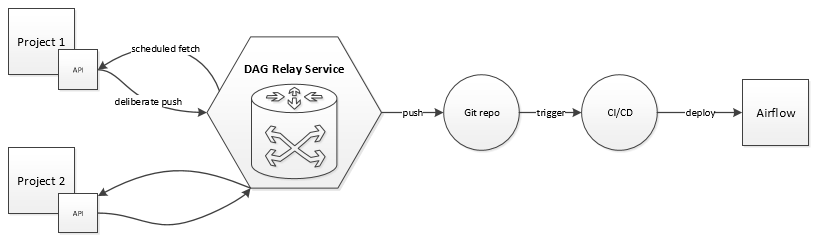
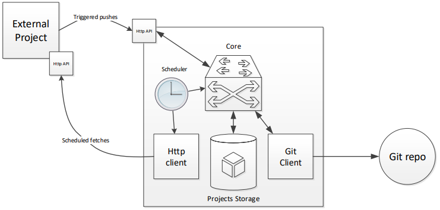

#####
Brief
#####

DAG Relay Service это сервис для упрощение работы с публикацией YAMLов DAGов в наш DataMesh (Airflow).
Общая схема взаимодейсвия: |diagram|

Какие проблемы призван решить данный сервис:

- абстрагироваться от необходимости пушить YAMLы DAGов напрямую в репозиторий DataMeshа
- возможность хранить YAMLы внутри репы самого проекта
- добавить возможность кастомной шаблонизии/генерации YAMLов, удобным каждому проекту
- добавить возможность генерить динамические YAMLы со стороны проекта
- сделать всё это прозрачно для команды DataMeshа, для них в итоге всё это будет выглядеть как push в git репозиторий

Основные компоненты системы: |components|

- ядро
- git repo client
- http endpoint for DAG pushes
- scheduler
- dag/resource fetcher (http client)

Основные сущности:

- проект (имя, токен, описание, url endpoint для фетчинга DAGов, настройки git репы)
- DAG/resource (YAML) (проект, имя, id, описание, YAML)
- update event (событие обновления, не обязательно приводит к deploymentу)
- deployment (сам акт выкадки ресурсов)

Предлагаемый stack:

- Scala 2.13
- ZIO 1.0
- http4s для web сервера
- sttp для http клиента
- doobie (если хранилище PG)
- circe
- pureconfig
- хз че для git клиента? Видимо сами напишем обвязку

