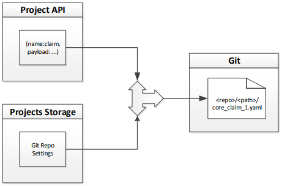

##############
Жизненный цикл
##############

DAG рождается и умирает только по сигналу от API: |dag_lifecycle|

Наличие отсутствие файла в папке gitа ни на что не влияет. Мы потом напишем отдельную утилиту проверяющую zombie файлы :)

